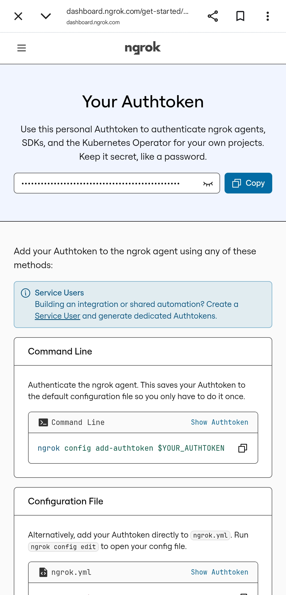

# L2P-Server
It is advanced Server of Version Simple-Server which is in my page.

 This L2P-Server project is a modified version of Simple-Server project which is in my github page. On Simple-Server is only for LocalHosting you can't use it globaly but This L2P-Server you are able to use it from any where but not that if you wana use it full version then you have to get premiumship of NGROK other wise you can use it free version also but on free version they will provide random domain name for your project and if you upgrade it to premium then you able to add your name on it.

<pre>
EX:- (Free  version) https://ienejwjwnw-hebeheb-nwbsh.ngrok-free.app
    (Upgraded version) xyz-zyx.ngrok-free.app
</pre>

<h1> Installation Proccess:- </h1>

<ul>
<li> pkg install git </li>
<li> git clone https://github.com/kedar1830/L2P-Server.git </li>
<li> cd L2P-Server </li>
<li> bash install.sh </li>
</ul>

<h1>Requirements</h1>

<ol>
<li>NGROK account</li>
<li>NGROK authentication token</li>

<li>NGROK static domain name</li>

</ol>

<h1>Code will ask you for this</h1>

<ul>
<li>your Ngrok doamin name</li>
<li>your port/ default(3000) </li>
<li>your auth token</li>
</ul>

This tool will ask you about this 3 things after that your code will run successfuly.

